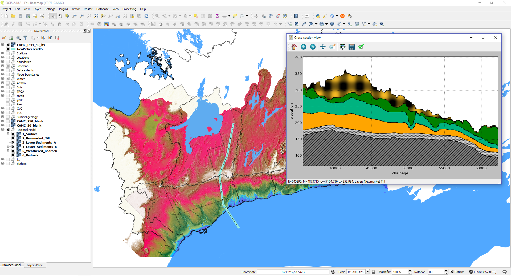

# GeoPicker

A QGIS plugin allows users to view and print geologic cross-sections

#### Getting started?

Check out the tutorial [here](tutorial\Readme.md) 

#### Want customize cross-section layer colouring scheme?

Follow [this](doc\layer_properties_instructions.md).

#### screenshot:
